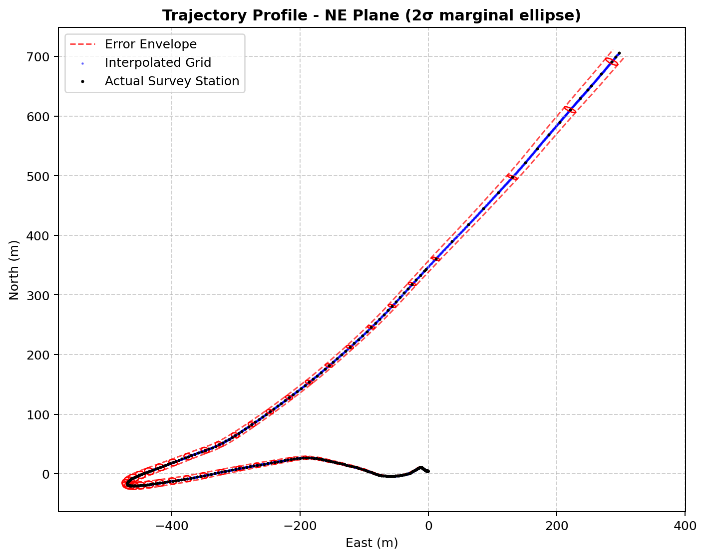
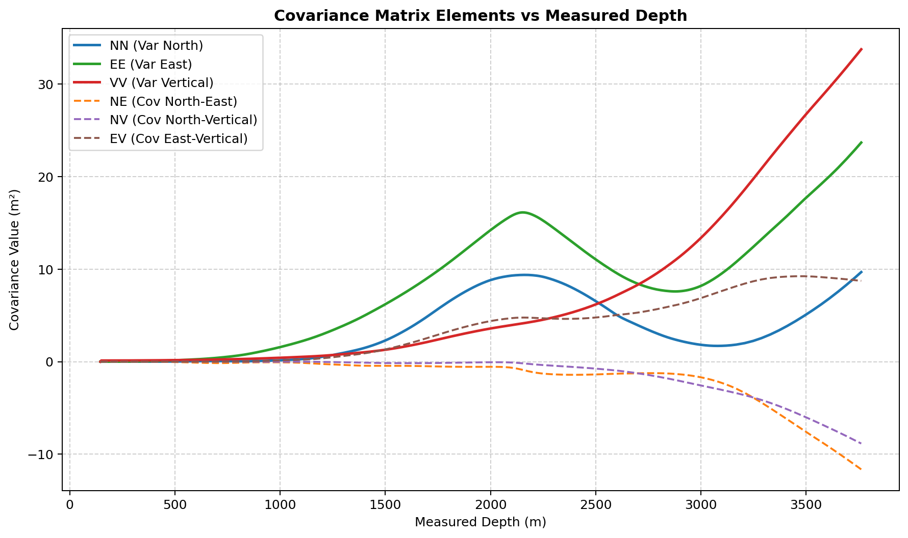
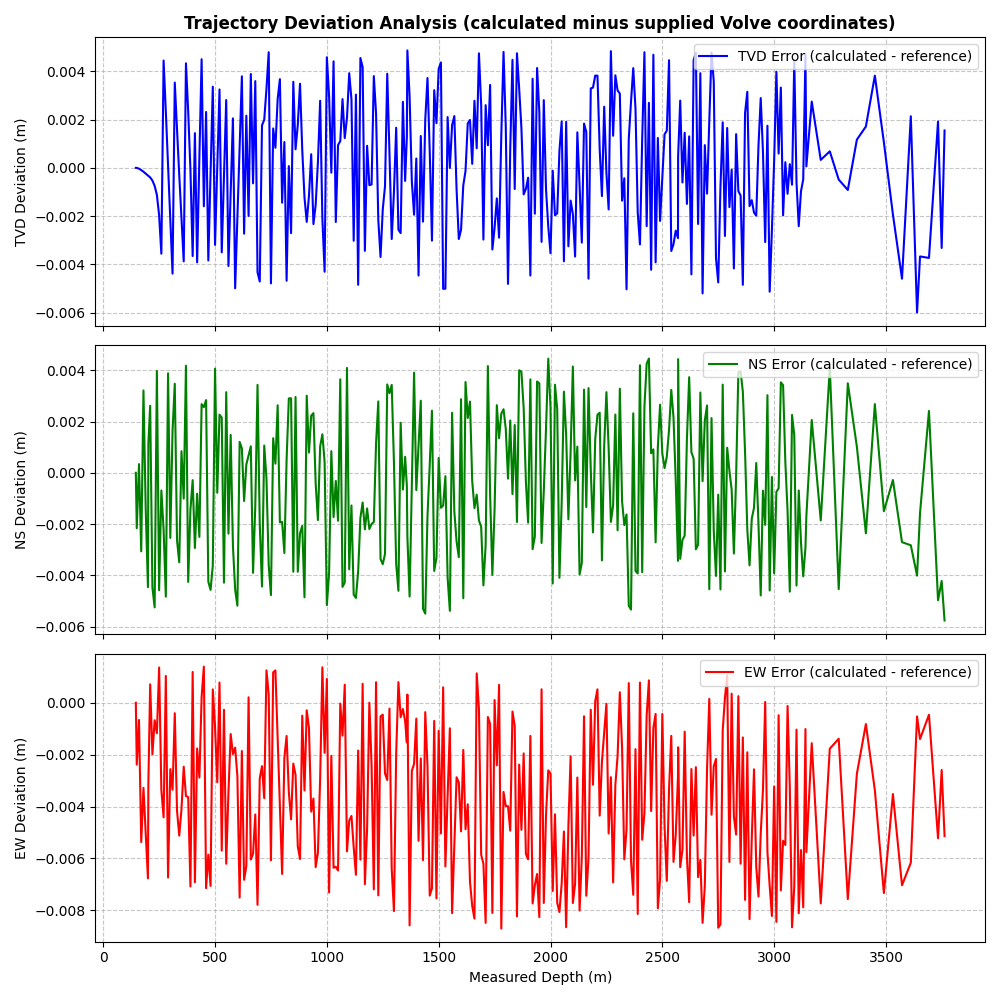

# Wellbore Trajectory and Position Uncertainty

Python framework for reconstructing a three-dimensional wellbore trajectory with the Minimum Curvature Method (MCM) and propagating a selected eleven-term ISCWSA Revision 5 uncertainty model. The project compares analytical MCM and Balanced Tangential (BT) sensitivities, validates them with central finite differences, and checks trajectory and covariance results against published benchmark data.

**Author:** Julian Czettl  
**Technical report:** [Wellbore Trajectory and Position-Uncertainty Modelling in Python](Report.pdf)  
**Full reproduction guide:** [REPRODUCIBILITY.md](REPRODUCIBILITY.md)

> This is an educational implementation using generic benchmark magnitudes. It is not a complete tool-specific Position Uncertainty Model or certified software for operational survey acceptance or anti-collision decisions.

## Key results

| Check | Result |
| --- | --- |
| Volve trajectory reconstruction | Maximum absolute coordinate residual: **8.70 mm** against the supplied rounded coordinates. |
| ISCWSA covariance benchmarks | BT sensitivities reproduce ten selected terms near floating-point precision; the largest DSTG element residual is **9.278 × 10⁻⁵ m²**. |
| Analytical Jacobians | Both MCM and BT formulations agree with their corresponding central finite differences at approximately **10⁻¹¹** maximum entrywise error. |
| MCM versus BT propagation | Maximum change in the NE 2σ semi-major axis: **1.559 mm**; full-covariance global BT-referenced relative RMS: **1.244 × 10⁻⁴**. |

These results apply to the included surveys and selected error-model subset. Their interpretation and limitations are discussed in the report.

## Results preview

### North-East trajectory and uncertainty



Volve well 15/9-F-11 A reconstructed with MCM and shown with 2σ marginal NE uncertainty ellipses. Generated by `main.py`; corresponds to report Figure 6a.

### Covariance versus measured depth



The six independent elements of the 1σ NEV covariance matrix at physical survey stations. Generated by `main.py`; corresponds to report Figure 9.

### Validation against supplied Volve coordinates



Calculated-minus-reference coordinate residuals from `csv_verification.py`; corresponds to report Figure 2.

## Quick start

Run the commands from the repository root, preferably in a virtual environment:

```bash
git clone https://github.com/Freak-1102/wellbore-trajectory-uncertainty.git
cd wellbore-trajectory-uncertainty
python -m pip install -r requirements.txt
python main.py
```

The default run processes `15_9_F_11_A.csv`, prints an end-of-well summary, saves plots and Jacobian tables under `main_results/15_9_F_11_A/`, and opens the PyVista 3D viewer. Close the viewer to finish. To skip all 3D output, set `show_pyvista=False` and `save_pyvista=False` at the bottom of `main.py`.

## What the pipeline does

1. Validates measured depth, inclination, azimuth, duplicate stations, and numerical bounds.
2. Reconstructs North, East, TVD, dogleg angle, and DLS using MCM.
3. Propagates the selected error sources into a cumulative 3 × 3 NEV covariance matrix.
4. Extracts 2D marginal ellipses, 3D principal axes, and end-of-well uncertainty values.
5. Produces trajectory, covariance, and diagnostic plots.
6. Runs benchmark, finite-difference, and MCM-versus-BT comparisons through separate scripts.

The 1 m SLERP grid in `main.py` supplies a smooth visual path. Covariance contributions are evaluated and accumulated at the physical survey stations.

## Data

| Input | Purpose |
| --- | --- |
| [`15_9_F_11_A.csv`](15_9_F_11_A.csv) | Volve survey with MD, inclination, azimuth, and supplied TVD/North/East coordinates; used for the case study and coordinate validation. |
| `error-model-example-mwdrev5-1-iscwsa-{1,2,3}.xlsx` | ISCWSA Revision 5 example workbooks; used for trajectory and covariance benchmark checks. |

CSV input requires `MD` in metres, `Incl` in degrees from downward vertical, and `Azi` in degrees clockwise from north. Optional `NS`, `EW`, and `TVD` columns provide the first station's tie-in coordinates.

## Reproduce the checks

| Purpose | Command |
| --- | --- |
| Main Volve calculation and visualizations | `python main.py` |
| Volve coordinate residuals | `python csv_verification.py` |
| Per-workbook ISCWSA verification | `python excel_verification.py` |
| ISCWSA coordinate residuals and maximum covariance element difference for all error terms | `python benchmark_summary.py` |
| Volve analytical Jacobians versus finite differences | `python jacobian_validation.py` |
| ISCWSA coordinate residuals plot | `python jacobian_validation_plot.py` |
| Volve uncertainty differences between MCM and BT | `python mcm_bt_comparison.py` |
| Volve uncertainty differences plot | `python mcm_bt_comparison_plot.py` |

The source, settings, and command for every report table and figure are documented in [REPRODUCIBILITY.md](REPRODUCIBILITY.md).

## Main modules

| File | Responsibility |
| --- | --- |
| `main.py` | End-to-end trajectory, covariance, reporting, and visualization pipeline. |
| `trajectory.py` | MCM trajectory reconstruction and SLERP interpolation. |
| `core_math.py` | Dogleg, ratio factor, analytical Jacobians, and ellipse decomposition. |
| `iscwsa_error.py` | Error-vector construction and covariance accumulation. |
| `reporting.py` | End-of-well and Jacobian comparison summaries. |
| `visualization.py` | 2D trajectory, covariance, variance-growth, and PyVista 3D plots. |
| `excel_verification.py` | Per-workbook ISCWSA benchmark evaluation. |
| `benchmark_summary.py` | ISCWSA coordinate residuals and maximum covariance element difference. |
| `jacobian_validation.py` | Analytical-versus-finite-difference checks. |
| `mcm_bt_comparison.py` | MCM-versus-BT uncertainry differences. |

## Sources

- [Equinor Volve dataset](https://www.equinor.com/energy/volve-data-sharing)
- [ISCWSA error-model documentation and benchmark workbooks](https://www.iscwsa.net/error-model-documentation/)
- Further technical references are listed in [Report.pdf](Report.pdf).
